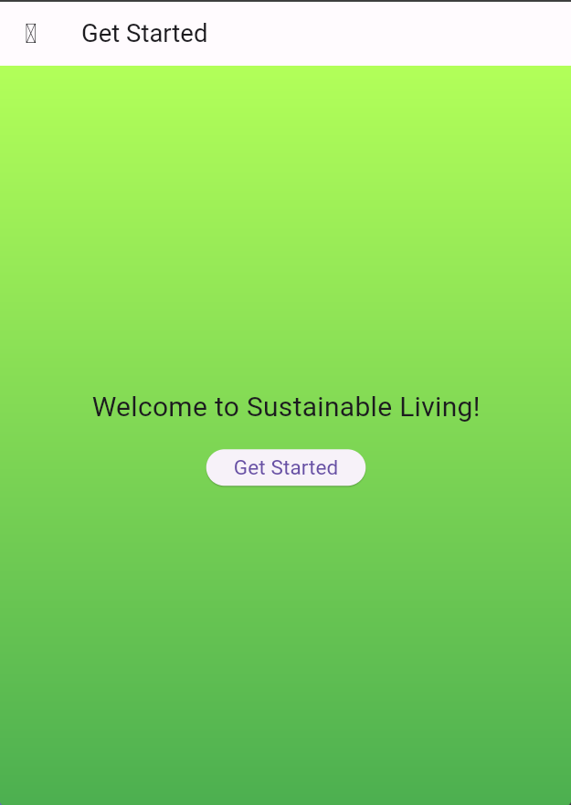
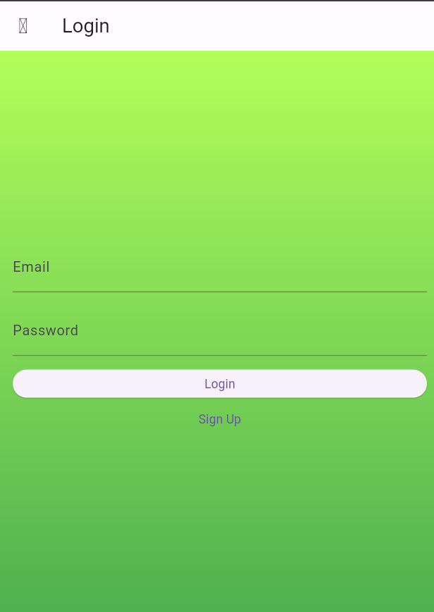
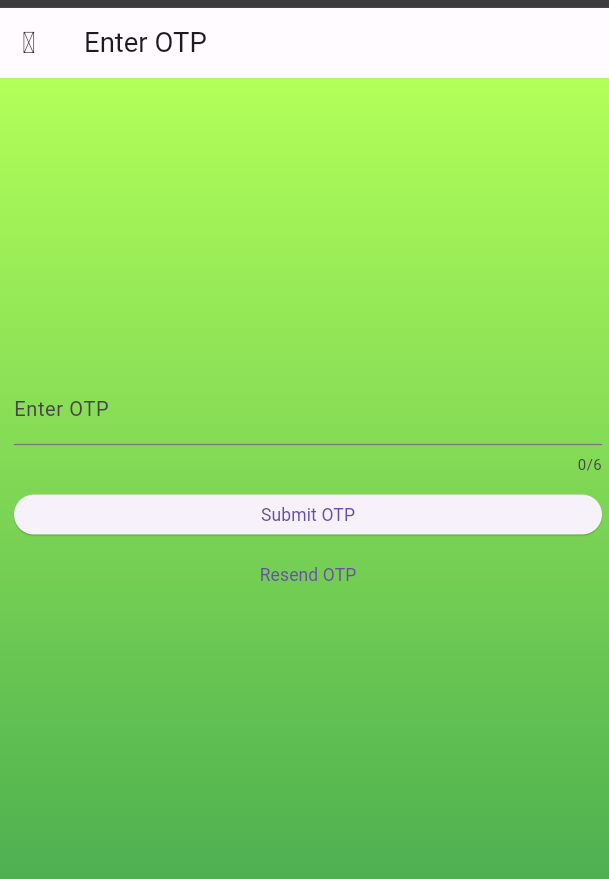
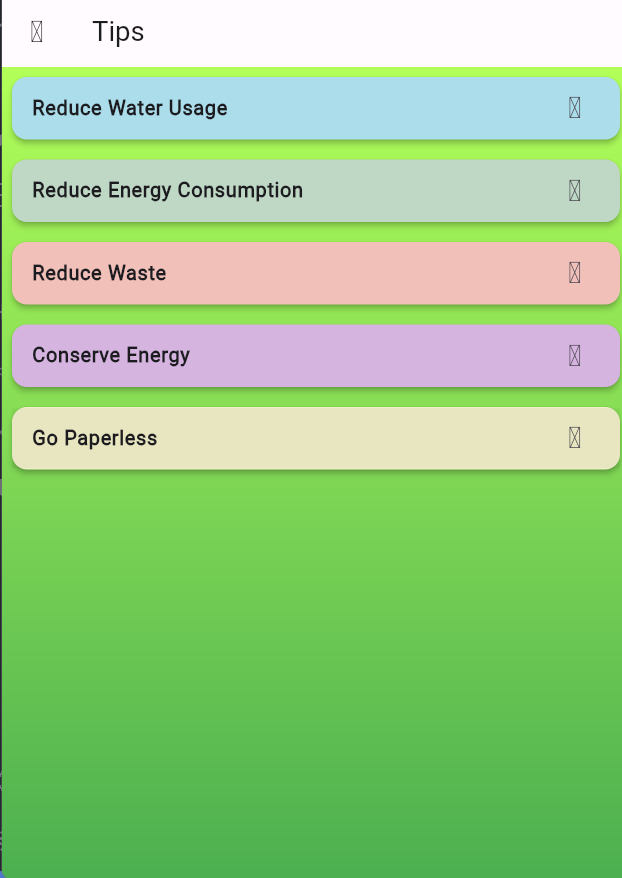

# Sustainable Living App

## Description
The Sustainable Living App is a mobile application designed to empower users to adopt sustainable practices in their daily lives. It provides information, tools, and community support to help users reduce their environmental impact and contribute to a more sustainable future.

## Features
- **Carbon footprint calculator**: Estimate carbon emissions based on daily activities.
- **Tips and articles**: Access articles and tips on sustainable living practices.
- **Challenges and goals**: Set and track personal sustainability goals.
- **Community**: Connect with like-minded individuals, share experiences, and participate in discussions.
- **Personalized recommendations**: Receive personalized suggestions for sustainable actions based on user preferences.

## Output Images
Here are some screenshots of the Sustainable Living App:

            

## Technologies Used
- **Flutter**: UI framework for building natively compiled applications for mobile, web, and desktop.
- **Dart**: Programming language used with Flutter for app development.

## Contributing
We welcome contributions to the Sustainable Living App! If you'd like to contribute, please follow these steps:

1. Fork the repository.
2. Create a new branch (`git checkout -b feature/improvement`).
3. Make your changes.
4. Test your changes thoroughly.
5. Commit your changes (`git commit -am 'Add new feature'`).
6. Push to the branch (`git push origin feature/improvement`).
7. Create a new Pull Request.

## Contact
For questions or support, please contact us at <a href="mailto:boopathiragul2003@gmail.com">Mail Me</a>.
